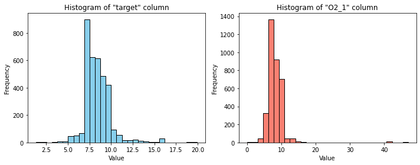
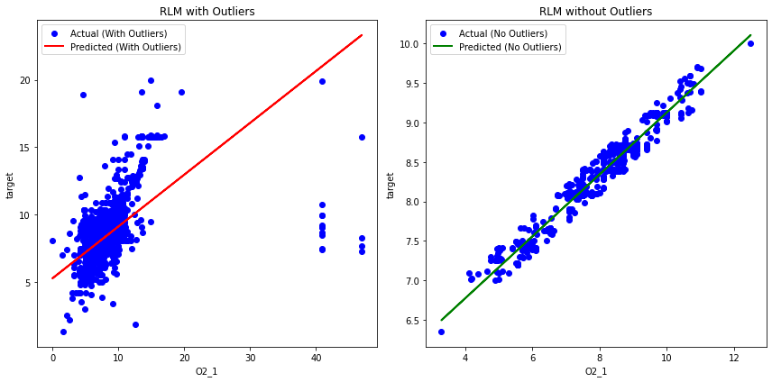

# Anomaly Removal and Minimization of RMSE in Regression

## Overview

In this project, we aimed to enhance the predictive performance of a regression model by addressing anomalies in the data and minimizing the Root Mean Square Error (RMSE). The dataset in question exhibited irregularities that potentially impacted the model's accuracy. Our objective was to preprocess the data, identify significant features, and ultimately improve the model's predictive power.

## Data Preprocessing

The initial dataset required thorough preprocessing to ensure data quality and reliability. Key steps in the data preprocessing phase included:

- Handling missing values
- Feature scaling or normalization as needed
- Encoding categorical variables
- Identifying potential outliers

## Baseline Model

Before addressing anomalies, we established a baseline model to gauge the initial performance. The baseline model's metrics were as follows:

- Baseline RMSE (Root Mean Square Error) with 10-fold Cross-Validation: 1.06
- Baseline R-squared (R²): 0.56

## Anomaly Detection and Removal

To improve the model's performance, we conducted the following steps:

1. **Normality Test**: We used the Shapiro-Wilk test to assess the normality of the data distribution. The test result was statistically significant, indicating non-normality.

2. **Robust Linear Model (RLM)**: In response to the non-normality, we implemented a Robust Linear Model (RLM) regression technique. RLM is less sensitive to outliers and suited for datasets with non-normal distributions.

3. **Outlier Removal**: Leveraging RLM, we identified and removed outliers from the dataset. This step aimed to reduce the influence of extreme data points on the model's predictions.

## Model Evaluation

After addressing anomalies and refining the dataset, we evaluated the improved model's performance. The results showed significant enhancements:

- RMSE with 5-fold Cross-Validation after Anomaly Removal: 0.11
- New R-squared (R²): 0.95

## Conclusion

This project demonstrated the importance of data preprocessing and anomaly detection in enhancing the performance of a regression model. By addressing non-normality and removing outliers, we achieved a substantial reduction in RMSE and a notable increase in R-squared. These improvements signify a more accurate and reliable predictive model.

The techniques and insights gained from this project can be applied to similar regression tasks where data anomalies may hinder model accuracy.

